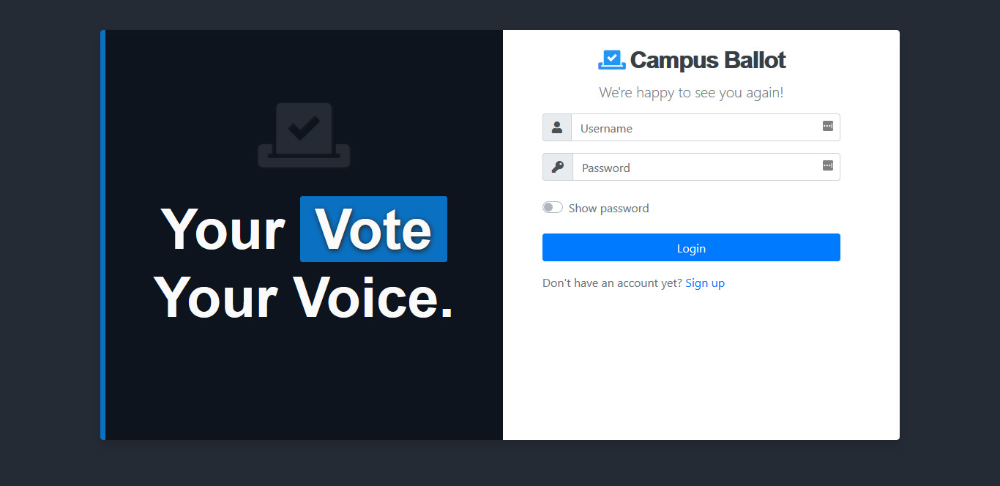
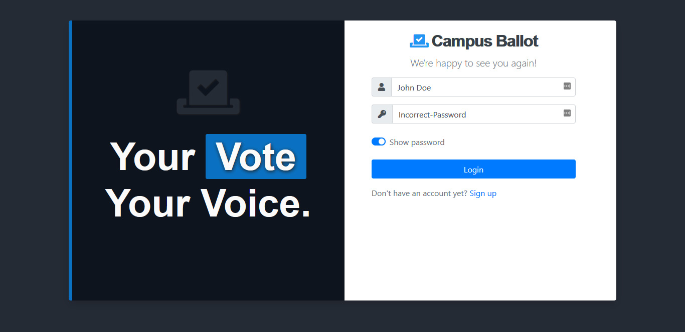
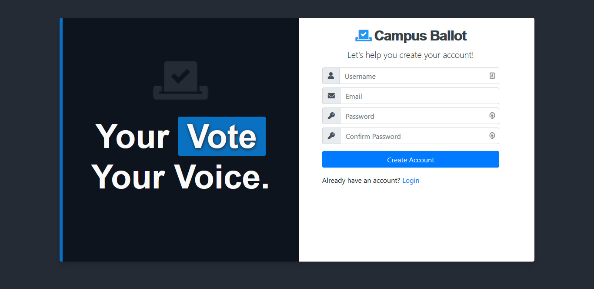
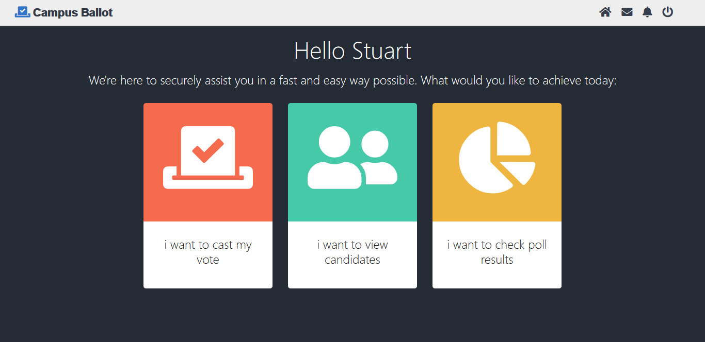
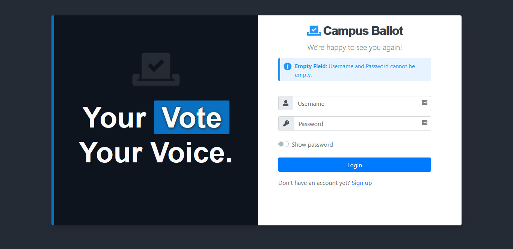
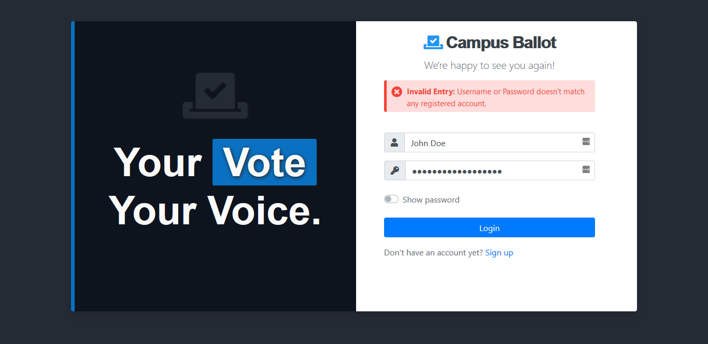

# Online Voting Web Application

Campus Ballot is an automated online voting app build to assist in conducting of guild elections in local universities.

 The project was initiated as part of my end of semester project. It is a very simple Online voting app am working on which gives users capabilities to vote for there favourite candidates at there universities online. 

 ## Screenshots
 ---

## Errors

>USERS
1. Admin
2. Voter

>ADMIN FEATURES

1. Login
2. Manage Administrators
3. Manage Candidates
4. Mange Positions
5. Check Poll Results
6. Update Password
7. Update Profiles
8. View all users
9. Create Profiles.
10. Delete user profiles.

> Voter/ User Features

1. Registration
2. Login
3. View and Update Profile
4. Choose Positions for voting
5. Give vote.
6. Logout

